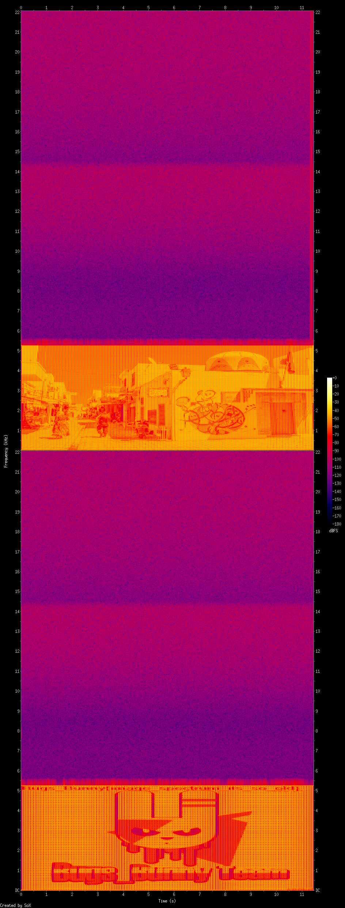

# 2017 Bugs_Bunny CTF - [Stego] steg150
## Problem
```
Listen to me or maybe look at me.
Link
```

## Solution
해당 wav 파일을 다운 받고 재생을 시켜보면, 기괴한 소리가 들립니다. `SOundeXchange` 를 통해서
`Spectrogram` 으로 이미지를 저장 시켜줍니다.

```
C:\Program Files (x86)\sox-14-4-2>sox.exe C:\Users\Administrator\Downloads\task.
wav\task.wav -n spectrogram -y1200 -z180
```

그리고 추출된 이미지를 확인하면 플래그가 나옵니다.





`Bugs_Bunny{image_spectrum_its_so_old}`
