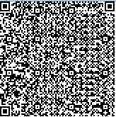

# 2014 HITCON CTF - [Misc] maze
## Problem
```
Capture the flag in the maze!

telnet 210.71.253.213 8473
```

## Solution
주어진 주소를 텔넷으로 연결을 합니다.

```
$ telnet 210.71.253.213 8473
Trying 210.71.253.213...
Connected to 210-71-253-213.hinet-ip.hinet.net.
Escape character is '^]'.

You have 10 minutes to capture the flag :)
Loading...
```

그리고, 게임을 하기 위해서 로딩이 끝나게 되면 다음과 같은 화면이 나옵니다.

```
.@..@....
@..@..@..
@....@@.@
@@...@@@@
@..@o....
.@@...@.@
..@.@..@.
@.....@@@
..@@.@.@@
```

여기서 `.`은 움직일 수 있는 칸, `@`은 벽, `o` 는 캐릭터입니다. 맵 여기저기를 돌아다니면서 해당 구조들을 모두 매핑하게 되면 `QR Code` 가 드러납니다.



해당 `QR Code` 를 디코드하면 다음과 같이 `Ascii Art` 가 나타납니다.

```
.  . , ,---.  ,-.  ,-.  .  . ,-  ,-.   ,-.  .   ,  ,.  ,---, ,--.   ,  ,-.     ,-.  ,-.   ,-.  ,    . -. 
|  | |   |   /    /   \ |\ | \  /   \  |  ) |\ /| /  \    /  |      | (   `   /    /   \ /   \ |    |  / 
|--| |   |   |    |   | | \| <  |   |  |-<  | V | |--|   /   |-     |  `-.    |    |   | |   | |    |  > 
|  | |   |   \    \   / |  | /  \   X  |  \ |   | |  |  /    |      | .   )   \    \   / \   / |       \ 
'  ' '   '    `-'  `-'  '  ' `-  `-' ` '  ' '   ' '  ' '---' `--'   '  `-'     `-'  `-'   `-'  `--' o -'
```


`HITCON{QRMAZE IS COOL!}`
